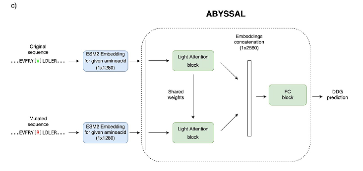

# abyssal-pytorch (wip)



Implementation of [Abyssal](https://www.biorxiv.org/content/10.1101/2022.12.31.522396v1.full), a deep neural network trained with a new "mega" dataset to predict the impact of an amino acid variant on protein stability.

## Installation

```shell
$ pip install abyssal-pytorch
```

## Usage
```python
import torch
from abyssal_pytorch import Abyssal

model = Abyssal()

wt_emb = torch.randn(1, 1280)    # ESM2 embedding for the wildtype amino acid.
mut_emb = torch.randn(1, 1280)   # ESM2 embedding for the mutated amino acid.

out = model(wt_emb, mut_emb)  # (1, 1) predicted ddG.
```

### Training from scratch
Please refer to `note/data-preprocessing.ipynb` notebook for data preprocessing. Running this notebook will generate `mega.train.csv`, `mega.val.csv` and `mega.test.csv` containing metadata for model training and evaluation.

For faster training, extract ESM2 embeddings and save them to the disk. It takes ~5 hours.
```shell
$ python prefetch_embeddings.py -i data/mega.train.csv -o data/embeddings
$ python prefetch_embeddings.py -i data/mega.val.csv -o data/embeddings
$ python prefetch_embeddings.py -i data/mega.test.csv -o data/embeddings
```

This will save embedding vectors in `.pt` format in `data/embeddings` directory.

You can now train model.

```shell
$ python -m abyssal_pytorch.train --train data/mega.train.csv --val data/mega.val.csv --test data/mega.test.csv --emb-dir data/embeddings
```

## Reproduction status

Unfortunately, I could not exactly reproduce the results based on the model and training specification in the current version of Abyssal preprint.
Below is the results from my best effort so far. Any ideas to reproduce the model performance would be appreciated!

|Metric|Target|Reproduced|
|------|:----:|:--------:|
Pearson's r|0.85+-0.00|0.7661|
Spearman's r|0.81+-0.01|0.7846|
MSE, kcal/mol|0.89|0.6003|
Accuracy (?)|0.79|?|
PCC(f-r)|-0.98|-0.9611|
delta|-0.01|-0.0330|

## Citations

```bibtex
@article {Pak2022.12.31.522396,
	author = {Pak, Marina A and Dovidchenko, Nikita V and Sharma, Satyarth Mishra and Ivankov, Dmitry N},
	title = {New mega dataset combined with deep neural network makes a progress in predicting impact of mutation on protein stability},
	elocation-id = {2022.12.31.522396},
	year = {2023},
	doi = {10.1101/2022.12.31.522396},
	publisher = {Cold Spring Harbor Laboratory},
	URL = {https://www.biorxiv.org/content/early/2023/01/02/2022.12.31.522396},
	eprint = {https://www.biorxiv.org/content/early/2023/01/02/2022.12.31.522396.full.pdf},
	journal = {bioRxiv}
}

```
